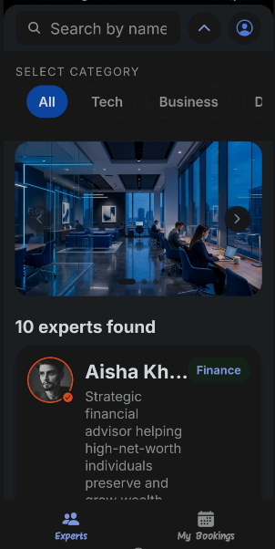
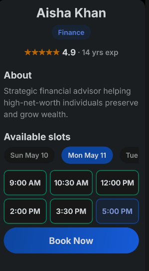
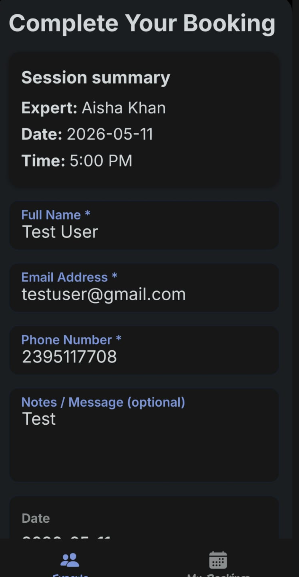
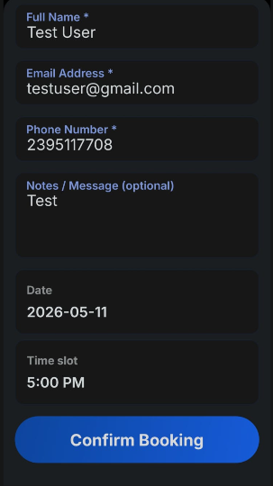
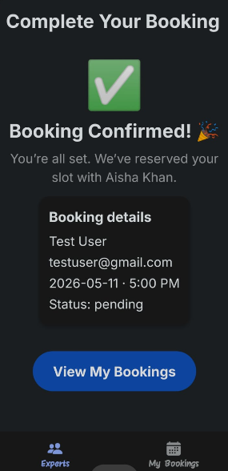
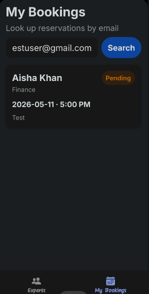

# 🗓️ Expertly

A premium, high-performance expert session booking platform designed with a **Liquid-Glass** aesthetic. This system provides a seamless bridge between experts and clients, featuring real-time availability, secure bookings, and a state-of-the-art mobile interface.

---

## 📸 Interface Gallery

<div align="center">
  <p align="center">
    
    
    
  </p>
  <p align="center">
    
    
    
  </p>
</div>

---

## 🚀 Tech Stack

### **Frontend (Mobile)**
- **Core:** React Native with Expo SDK
- **Styling:** Custom "Liquid Glass" Design System (Vanilla Styles)
- **Navigation:** Expo Router / React Navigation
- **Animations:** React Native Animated API for premium transitions
- **Icons:** Lucide-React-Native & Ionicons

### **Backend (API)**
- **Runtime:** Node.js (v18+)
- **Framework:** Express.js
- **Database:** MongoDB via Mongoose
- **Real-time:** Socket.io for live booking notifications
- **Emailing:** Resend for reliable session confirmations

---

## 🧠 System Architecture

The system follows a modern **Client-Server Architecture** optimized for low latency and high availability:

1.  **Mobile Client:** A cross-platform app that handles user interactions, session discovery, and real-time UI updates.
2.  **API Layer:** A RESTful Node.js server that manages business logic, user authentication, and expert scheduling.
3.  **Real-time Layer:** A Socket.io implementation that broadcasts booking status updates to all relevant clients instantly.
4.  **Data Layer:** A document-oriented MongoDB database storing experts, user profiles, and session history.

---

## ⚙️ Logic & Workflow

### **1. Discover & Selection**
Users browse through a curated list of experts. The system filters available slots based on real-time database queries, ensuring no double-bookings.

### **2. Booking Pipeline**
- **Validation:** Every booking request is validated against the expert's schedule and the user's eligibility.
- **Transaction:** The session is marked as 'Pending' and locked during the checkout phase.
- **Confirmation:** Upon success, the status is updated via WebSockets, and a confirmation email is dispatched via Resend.

### **3. Session Management**
Both users and experts have a dedicated dashboard to manage upcoming, ongoing, and past sessions, with integrated countdown timers and feedback systems.

---

## 💎 Design Philosophy

This project adheres to a **Premium Glassmorphism** design language:
- **Color Palette:** Deep Navy (#000926), Sapphire Blue (#0F52BA), and Ice Blue (#D8E6F3).
- **Aesthetics:** High-fidelity translucency, subtle micro-animations, and liquid gradients.
- **UX:** Intuitive navigation and a focus on visual hierarchy and readability.

---

## 🛠️ Setup & Installation

1. **Clone the repository:**
   ```bash
   git clone <repo-url>
   ```

2. **Backend Setup:**
   ```bash
   cd backend
   npm install
   npm start
   ```

3. **Mobile Setup:**
   ```bash
   cd mobile
   npm install
   npx expo start
   ```

---

## 📄 License

This project is licensed under the MIT License - see the [LICENSE](LICENSE) file for details.

---

<p align="center">Built with ❤️ for a seamless expert-client experience.</p>
